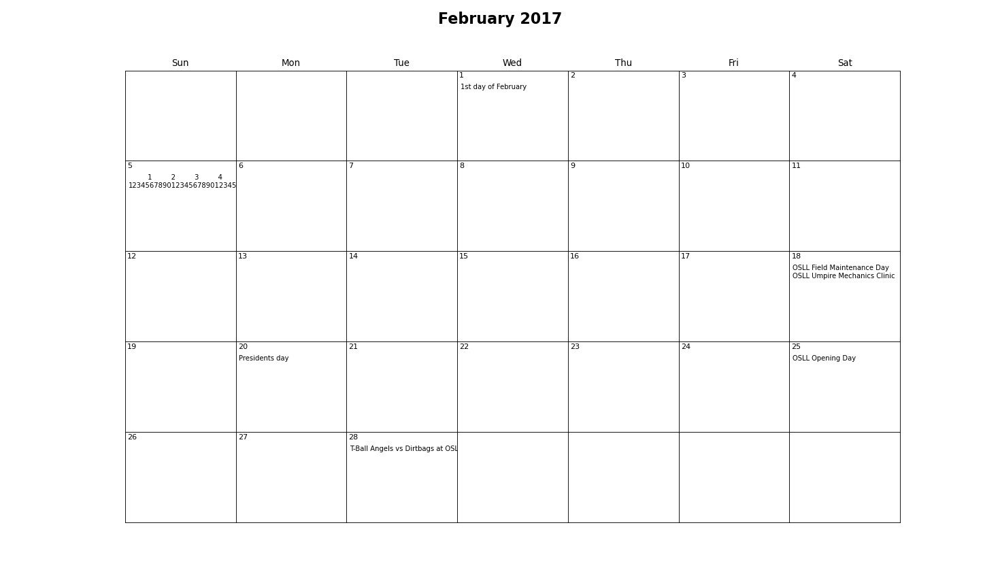

mplcal
======

Create basic printable calendars from Python.

Example:
-------

Create this calendar:

with the code:

.. code-block :: python

    from mplcal import MplCalendar
    feb = MplCalendar(2017, 2) # 2017, February
    feb.add_event(1, '1st day of February')
    feb.add_event(5, '         1         2         3         4         5         6')
    feb.add_event(5, '123456789012345678901234567890123456789012345678901234567890')
    feb.add_event(18, 'OSLL Field Maintenance Day')
    feb.add_event(18, 'OSLL Umpire Mechanics Clinic')
    feb.add_event(20, 'Presidents day')
    feb.add_event(25, 'OSLL Opening Day')
    feb.add_event(28, 'T-Ball Angels vs Dirtbags at OSLL')
    feb.show()
